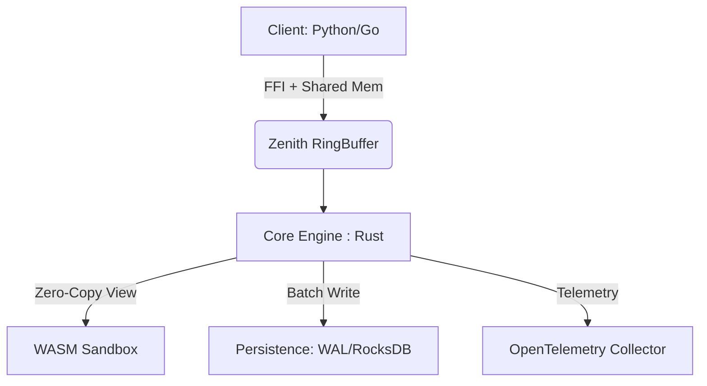

# Zenith Data Plane: System Architecture

**Version:** 1.0.0-MVP  
**Status:** Implementation Phase

## 1. High-Level Overview

Zenith is a high-performance data plane designed for sub-100µs latency using shared-memory ring buffers and zero-copy Arrow payloads. It acts as a bridge between high-level languages (Python/Go) and low-level packet processing or analytics logic.

## 2. Component Design

### 2.1 Ring Buffer (The transport)
We utilize a Lock-Free Ring Buffer (backed by `crossbeam-queue` in MVP, `Disruptor` in Enterprise). 
*   **Properties:** Bounded, MPMC safe.
*   **Memory:** Stores `ZenithEvent` envelopes.

### 2.2 Payload: Apache Arrow
Data is stored as `Arrow RecordBatch`.
*   **Why?** Standardization. A Python client uses `pyarrow` to write a batch into shared memory. Rust reads the metadata. No serialization occurs.
*   **Format:** IPC Stream format.

### 2.3 Compute: Wasmtime Host
User logic runs in WASM.
*   **Isolation:** Memory safety via WASM sandbox.
*   **Interface:** Host exposes `read_column(col_idx, row_idx)` functions.

## 3. Data Flow

1.  **Ingest:** Client creates an `EventHeader` + `RecordBatch`. Pushes to RingBuffer.
2.  **Dispatch:** Engine thread wakes up (busy-spin or parked). Pops event.
3.  **Process:** Engine iterates loaded WASM plugins. Calls `on_event()`.
4.  **Completion:** Event serves downstream (Network/Disk).

## 4. Security Model

*   **FFI Safety:** Checked boundaries at C-ABI layer.
*   **WASM:** Resources (CPU/RAM) limited by `wasmtime::Config`. Filesystem access denied by default (WASI sandbox).

## 5. Directory Structure

*   `core/`: The Rust implementation.
*   `sdk-*/`: Client bindings.
*   `bench/`: Performance validation tools.
